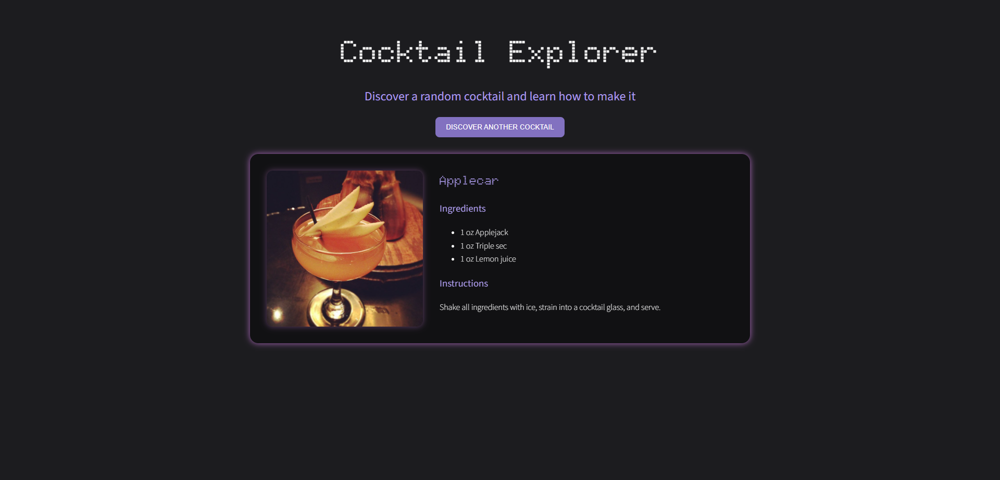

# Cocktail Explorer

A web app that displays a random cocktail with its image, ingredients, measurements, and preparation instructions.

## Preview



## Features

- Discover a random cocktail with one click.
- View ingredients and preparation instructions.
- Responsive layout for desktop and smaller screens.
- User-friendly error message when a cocktail cannot be loaded.
- Custom dark theme with pixel-style headings and purple accents.

## Technologies

- Node.js
- Express.js
- Axios
- EJS
- HTML and CSS
- Google Fonts

## Getting started

You need Node.js and npm installed.

Run these commands from the project folder:

```bash
npm install
node index.js
```

Then open http://localhost:3000 in your browser.

To stop the server, press Ctrl + C in the terminal.

An internet connection is required to load cocktail data, images, and Google Fonts.

## How it works

The browser sends a GET request to the Express server.
The server uses Axios to fetch a random cocktail from TheCocktailDB.
EJS renders the returned data as an HTML page.

API requests have a 10-second timeout. If a request fails or no cocktail is returned, the app displays an error message.

## API

Cocktail data and images are provided by [TheCocktailDB](https://www.thecocktaildb.com/).

This educational project uses the development test key `1`.

## Project background

Built as part of Angela Yu's Complete Web Development Bootcamp API capstone, with step-by-step AI assistance.

I customized the visual design, typography, colors, and glow effects.

## Author

Milica Mijačić  
GitHub: [milicasenpai](https://github.com/milicasenpai)
